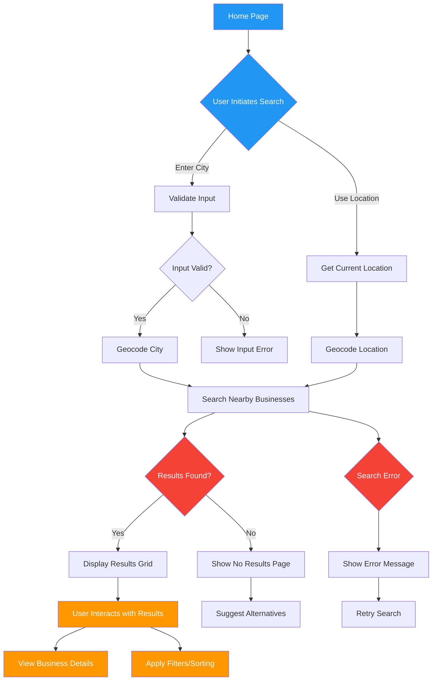

# Tea Finder App: Search User Flow

## Key User Experience Principles

1. **Speed**: 
   - Instant feedback
   - Minimal loading times
   - Predictive search suggestions

2. **Clarity**:
   - Simple, intuitive interface
   - Clear error messages
   - Helpful guidance

3. **Flexibility**:
   - Multiple search methods
   - Comprehensive result handling
   - User-friendly error recovery

## Performance Optimization Strategies

- Client-side caching of search results
- Debounce search input
- Lazy loading of business details
- Efficient API request management

## Accessibility Considerations

- Keyboard navigation
- Screen reader support
- High contrast mode
- Responsive design across devices
